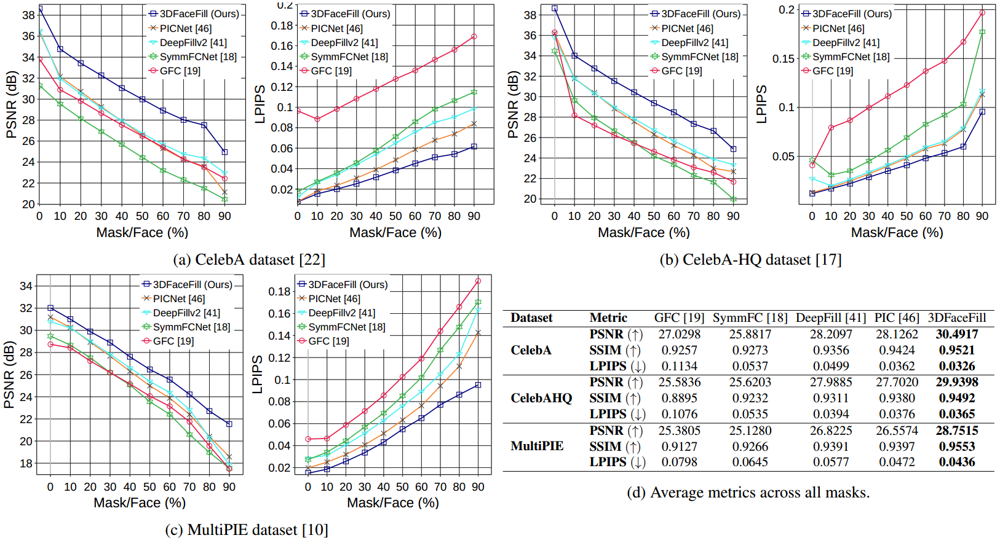

# *3DFaceFill-eval*


1. Install python3.6 and torch1.4 using conda:

```
conda create -n py36_torch14 python=3.6

conda install pytorch==1.4.0 torchvision==0.5.0 cudatoolkit=10.1 -c pytorch

```


2. Install removed pytorch3d tarball from here:

[https://anaconda.org/pytorch3d/pytorch3d/files?version=0.2.0](https://anaconda.org/pytorch3d/pytorch3d/files?version=0.2.0)

e.g. `wget` [https://anaconda.org/pytorch3d/pytorch3d/0.2.0/download/linux-64/pytorch3d-0.2.0-py36_cu101_pyt14.tar.bz2](https://anaconda.org/pytorch3d/pytorch3d/0.2.0/download/linux-64/pytorch3d-0.2.0-py36_cu101_pyt14.tar.bz2)

and then `conda install pytorch3d-0.2.0-py36_cu101_pyt14.tar.bz2`


3. Create `constraints.txt`with the following lines to protect versions from overwriting with pip:

```
torch==1.4.0
torchvision==0.5.0
opencv-python==4.5.5.64
```

Install MTCNN-onnx:

```
python3 -m pip install mtcnn-onnxruntime -c constraints.txt
```

Fix mtcnn, go to the (depending on your environment):

```
nano /home/ubuntu/anaconda3/envs/py36_torch14/lib/python3.6/site-packages/mtcnn_ort/onnx_runner.py

```

Change `from cv2 import cv2` to `import cv2`


Compile zbuffer as they suggest:

```
cd zbuffer/
python3 setup.py install
```

There can be a problem with old torch and new GPU like A100. If it complains on `Unknown CUDA arch (8.0) or GPU not supported` (where the number is >=8.0), go to the (depends on your anaconda path):

```
nano /home/ubuntu/anaconda3anaconda3/envs/py36_torch14/lib/python3.6/site-packages/torch/utils/cpp_extension.py
```
Find the line 

```
supported_arches = ['3.5', '3.7', '5.0', '5.2', '5.3', '6.0', '6.1', '6.2',
                        '7.0', '7.2', '7.5']
                        
```

And add `8.0`


Do everything needed in original repo - download checkpoints and 3DMM data. 


Run `python test_my.py --config args.txt --ngpu 1 --resolution [256,256] --eval`

Install all necessary packages it asks for, using constraint: `python3 -m pip install <package> -c constraints.txt`

It will work on CPU though, I removed GPU from everywhere because zbuffer was failing. But zbuffer itself is working on GPU. Maybe it will not happen on your GPU.


But the results are faulty at the moment, described in original repo issues, the probems are:


1. it seems that occlusion prediction network is not working properly - it predicts random rectangular occlusions

2. White noise instead of texture 


------------------------------------


# *3DFaceFill: An Analysis-by-Synthesis Approach for Face Completion*

## Abstract
Existing face completion solutions are primarily driven by end-to-end models that directly generate 2D completions of 2D masked faces. By having to implicitly account for geometric and photometric variations in facial shape and appearance, such approaches result in unrealistic completions, especially under large variations in pose, shape, illumination and mask sizes. To alleviate these limitations, we introduce 3DFaceFill, an analysis-by-synthesis approach for face completion that explicitly considers the image formation process. It comprises three components, (1) an encoder that disentangles the face into its constituent 3D mesh, 3D pose, illumination and albedo factors, (2) an autoencoder that inpaints the UV representation of facial albedo, and (3) a renderer that resynthesizes the completed face. By operating on the UV representation, 3DFaceFill affords the power of correspondence and allows us to naturally enforce geometrical priors (e.g. facial symmetry) more effectively. Quantitatively, 3DFaceFill improves the state-of-the-art by up to 4dB higher PSNR and 25% better LPIPS for large masks. And, qualitatively, it leads to demonstrably more photorealistic face completions over a range of masks and occlusions while preserving consistency in global and component-wise shape, pose, illumination and eye-gaze.

## Overview
3DFaceFill is an iterative inpainting approach where the masked face is disentangled into its 3D shape, pose, illumination and partial albedo by the 3DMM module, following which the partial albedo, represented in the UV space is inpainted using symmetry prior, and finally the completed image is rendered.


## Contributions
* Face completion using explicit 3D priors leading to geometrically and photometrically better results
* We leverage facial symmetry efficiently for face completion
* Qualitative and quantitative improvement in face completion under diverse conditions of shape, pose, illumination, etc

## Data Preparation
3DFaceFill is trained using the CelebA dataset. We preprocess the CelebA dataset to align and crop the face images. To do this, edit the process_celeba.py file to point the celeba_dir variable to the path of the CelebA dataset. Then, run the script as python process_celeba.py

## Setup
Set up a conda environment with Python 3.6 and PyTorch 1.4.0. Use the attached env.yml file to create the environment with all the required libraries conda env create -f env.yml

In addition, install the zbuffer cuda library using the following steps:
1. cd zbuffer/
2. python setup.py install

Download the pretrained 3DMM and Face Segmentation models from https://drive.google.com/drive/folders/1Pf1CEWjX1DtovTE4NDgiyE3CzAN-ucmC?usp=sharing to the ./checkpoints/ directory.

Download 3DMM_definition.zip from https://drive.google.com/file/d/1EO6Mb0ELVb82ucGxRmO8Hb_O1sb1yda9/view?usp=sharing and extract to datasets/

## Usage
To train the network from scratch, run:
python main.py --config args.txt --ngpu 1

To evaluate the network, run:
python main.py --config args.txt --ngpu 1 --resolution [256,256] --eval

## Results
Quantitative results on the CelebA, CelebA-HQ and MultiPIE datasets.


Qualitative results with artificial masks.


Qualitative results with real occlusions.

